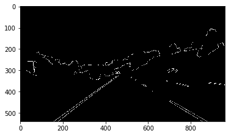
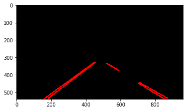

## Finding Lane Lines on the Road
A software pipeline that uses traditional computer vision (CV) techniques to identify and track the position of lane lines in a video stream. 

## Pipeline

**Grayscale** 

**Gaussian Smoothing**

Apply gaussian smoothing before running canny. This is a way of suppressing noise and spurious gradients by averaging. Note: cv2.Canny() applies gaussian smoothing internally, but it is not a changeable parameter, and lane detection can benefit from more smoothing

**Canny Edge Detection**

The canny edge detection algorithm will first detect strong edge (strong gradient) pixels above the high_threshold, and reject pixels below the low_threshold. Next, pixels with values between low_threshold and high_threshold will be included as long as they are connected to strong edges. The output is a binary image with white pixels tracing the detected edges and black everywhere else. 

**Region of interest mask**

Since lane lines generally only appear in a trapezoidal region in the lower half / horizontal center, we can ignore other parts of the image

**Hough Transform**

**Extrapolate Lane Line Position**

It can be determined which lane line (left vs right) a line segment belongs to by looking at the slope of the line segment. For each side, we average the line segment slopes and intercepts to find the best lane line fit for this frame. We then average the past 5 frames worth of slopes and intercepts to produce our final lane line position. Averaging over previous frames smooths the lane line fit.

**Apply color and transparency to lines**

## Dependencies 
* Python 3
* Numpy
* matplotlib
* OpenCV
* Jupyter Notebook
* moviepy

Note: I recommend installing the Anaconda Python 3 distribution from Continuum Analytics <A HREF="https://www.continuum.io/downloads" target="_blank">here</A> because it comes prepackaged with many of the Python dependencies. Also note that Udacity has a nice Anaconda environment that includes many of the dependencies used in the Self-Driving Car Nanodegree: [CarND Term1 Starter Kit](https://github.com/udacity/CarND-Term1-Starter-Kit/blob/master/README.md)

## Running the code 
The project is completed in a Jupyter notebook. 
You will complete this project in a Jupyter notebook. To start Jupyter in your browser, run the following command at the terminal prompt and within your Python 3 environment:

`> jupyter notebook`

A browser window will appear showing the contents of the current directory.  Click on the file called "P1.ipynb".  Another browser window will appear displaying the notebook. 
